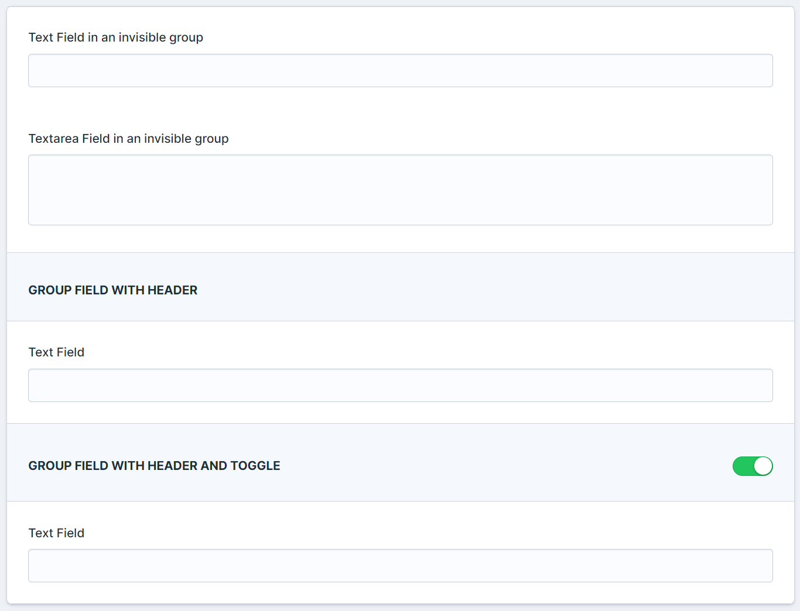
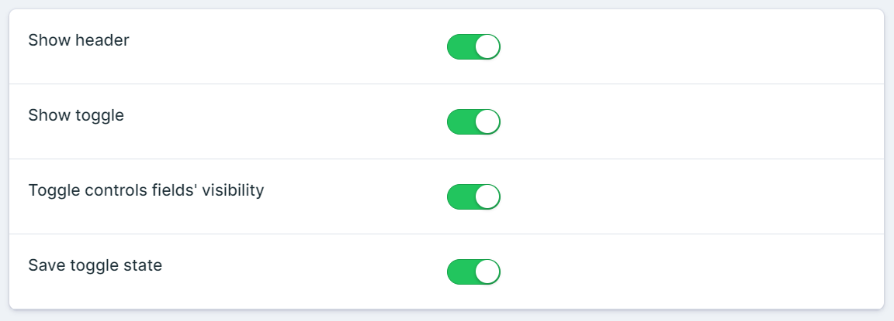

# Statamic Group

A Statamic plugin that adds a Group Fieldtype.<br>
You can group other fields without affecting their scope and you can control those groups' visibility with regular Statamic field conditions.
You can also optionally show a header and a toggle.



## Installation

Install this plugin using composer.

```cli
composer require eminos/statamic-group
```

## Features

- Group fieldtype that starts a new group wherever you put it in the blueprint or fieldset.
- By default the group is not doing anything, but you can control its visibility with other fields and conditions.
- You can choose to show a header (same design as the build-in Section fieldtype).
- You can choose to show a toggle.
- You can choose if that toggle controls the visibility of the groups' fields.
- You can choose if you want the toggle state to be saved or not.

### Here's a screenshot of the config options.




## License

The MIT License (MIT). Please see [License File](LICENSE.md) for more information.